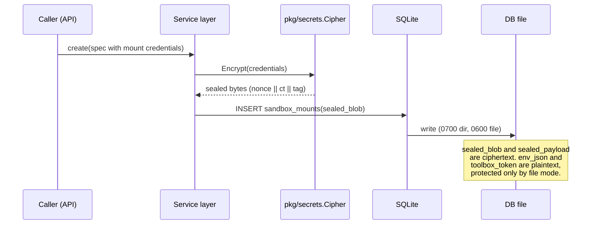
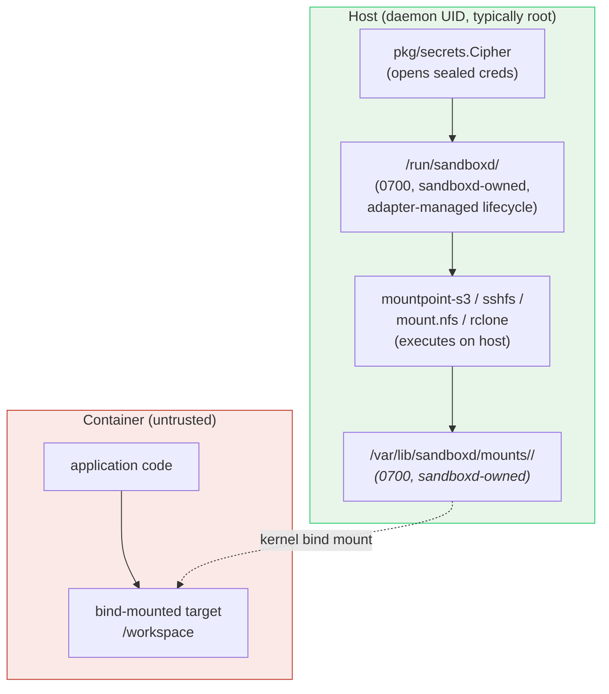

import { Tabs, TabItem } from '@astrojs/starlight/components';

A sandbox runs untrusted code. Sensitive operations (credential storage, mount
tooling, egress policy, byte accounting) execute on the host, not in the
sandbox. This page documents what that buys, what it does not, and where the
rule does not hold. Every path and symbol below is grep-able at the current
main.

## Threat model

**In scope.** A tenant running arbitrary code inside their own sandbox.
A tenant trying to read a different tenant's storage credentials, mount
contents, or network traffic. A tenant trying to forge their own
quota-accounting numbers or escape an egress rule. An operator with shell
access to the host who is reading the on-disk state from outside the daemon
process.

**Out of scope (non-goals).** A kernel CVE used to break the container
runtime (see "What about runc?" below). A malicious operator with the
sandboxd process address space, the AES key file, or root on the host:
sandboxd holds plaintext for every secret it stores. A malicious container
image; image trust is the caller's problem. Side-channel attacks across
tenants sharing a physical CPU (Spectre / L1TF class). The user-supplied
`env` block on a sandbox: it is propagated into the container as ordinary
environment variables and is visible to every process there, including the
in-container agent (see "What about toolboxd?" below). Treat `env` as
"shared with the guest by design". Image references supplied to sandbox
create APIs must be plain docker references — transport prefixes
(`oci-archive:`, `docker-archive:`, `oci:`, `dir:`, …) are rejected at the
tenant entry points, so a tenant cannot point the daemon at an arbitrary
host file path; internal template/build pipelines (operator-only) keep
transport refs. Each sandbox also runs under a per-sandbox pids limit
(`SB_SANDBOX_PIDS_LIMIT`, default 1024, `0` disables) so a runaway process
tree inside a container cannot exhaust the host's pids.

## What about runc?

The default runtime is Docker / runc. **runc is a resource-isolation
boundary. It is not a security boundary against a kernel-level attacker.**
A container escape via a Linux CVE puts the attacker on the host kernel,
at which point the chmod and seal work below is moot.

Operators who need a real isolation boundary should set the per-sandbox
runtime to gVisor (user-mode kernel, syscall-level isolation) or
Firecracker (KVM microVM, hardware virtualization). See
[Isolation](/gvisor-sandbox) and
[Firecracker Architecture](/firecracker-architecture). Pick the runtime
that matches the tenant trust model; runc is the default because most
single-tenant deployments do not need more.

## What about toolboxd?

`cmd/toolboxd` is the in-container agent. Its job is to run arbitrary
commands authorized by a bearer token (`cmd/toolboxd/main.go:34,459`):
exec, file IO, sessions, environment manipulation. It is intentionally
a remote-code-execution endpoint scoped to a single sandbox. Static
analyzers will flag command and path injection sites inside `cmd/toolboxd`;
those are by design. The trust boundary the agent sits behind is the
container, not its own input validation. Anyone holding the per-sandbox
toolbox token (32 random bytes, hex-encoded, generated at
`internal/service/service.go:4140-4146`) gets full execution authority
inside that one container.

toolboxd is **fail-closed on auth**: if `SB_TOOLBOX_TOKEN` is empty, the
exec endpoint refuses requests instead of serving unauthenticated. The only
bypass is the explicit dev-only escape hatch `SB_TOOLBOX_AUTH_OPTIONAL=true`
(warned at startup), which must never be set in production — parked and
warm containers always carry a bootstrap token, so normal launch paths are
unaffected.

## What about SSH?

The SSH gateway (`pkg/sshgateway/gateway.go`) terminates SSH on the host
and bridges accepted sessions to `docker exec` against the target
container. Every sandbox is created with a fresh ed25519 keypair; the
public key is persisted on the sandbox row, and that key is the only one
authorized to SSH into that one sandbox (gateway.go:54-67). There is no
global tenant key. The gateway's host key, however, is loaded once per
host (`pkg/sshgateway/config.go:16-30`); compromise of that host key
enables MITM against every SSH session terminating on that host. Rotation
is an operator action.

## Property 1: per-mount credentials are sealed before they cross any boundary

`pkg/secrets/secrets.go` defines `Cipher`, an AES-256-GCM AEAD:

```go
// Cipher seals and opens user-supplied secrets (cloud credentials for sandbox
// mounts) using AES-256-GCM. The seal format is `nonce(12) || ciphertext+tag`.
// The key never leaves this package; sealed bytes are what crosses other
// trust boundaries (DB, logs, error messages).
```

The 32-byte AES key never leaves `pkg/secrets`. `NewCipher` accepts either an
explicit base64-encoded key (operator-supplied) or a fallback path; on first
run with neither present, it generates a fresh key, writes it to the fallback
path at `0o600`, and uses that (`pkg/secrets/secrets.go:98-119`). `Cipher`
exposes no method that returns the key bytes. A caller in the same process
can still re-read the fallback file from disk (same trust domain, same
binary, same UID); the no-getter rule prevents accidental misuse, not a
determined caller.

**What is sealed.** `sandbox_mounts.sealed_blob` and
`cluster_secrets.sealed_payload` are the two columns written through
`Cipher.Encrypt` before insert (`internal/store/store.go:108-113,146-154`).
A `sqlite3 .dump` of those tables yields ciphertext.

**What is not sealed.** `sandboxes.env_json` is declared
`TEXT NOT NULL` (`internal/store/store.go:69`) and written as plain JSON
through `marshalJSON` (`internal/store/store.go:608`).
`sandboxes.toolbox_token` is declared `TEXT NOT NULL DEFAULT ''`
(`internal/store/store.go:72`) and assigned the hex output of
`generateToolboxToken` directly (`internal/service/service.go:4140-4146`).
The store's own comment at `internal/store/store.go:571-573` calls this
out: those columns would be world-readable from SQLite's umask, and the
at-rest protection is the explicit file-mode chmod in Property 2, not
encryption. A `sqlite3 .dump` of `sandboxes` yields plaintext for both.
Closing that gap (sealing `env_json` end-to-end, sealing `toolbox_token`
at rest with an in-process unsealer) is on the roadmap and not done.

`EncryptWithAAD` / `DecryptWithAAD` exist on `Cipher`. Two callers actually
bind AAD today: `clusterSecretKeyAAD` and `clusterSecretPayloadAAD` in
`internal/service/cluster_secrets.go:142-143` wrap the cluster DEK and seal
the payload with recipient-bound AAD, so a stolen cluster envelope cannot
be replayed against a different recipient set. The per-mount path
(`sealMounts` and `sealRegistry`, `internal/service/service.go:1329,1365`)
calls `s.cipher.Encrypt(plain)` with no AAD. The AOCR wrap
(`pkg/secrets/upstream_wrap.go:89-93`) also passes nil AAD on purpose to
match the JS unwrap side; the `Scope` field travels inside the plaintext
envelope, not bound as AAD. Replay protection therefore exists for cluster
secrets and not for per-mount credentials.



> **Invariant.** Per-mount credentials and cluster-secret payloads are
> cleartext only inside `pkg/secrets`. They cross every other boundary
> (DB file, logs, Raft log, error messages) as a sealed blob. The
> `env_json` and `toolbox_token` columns are cleartext at rest; their
> only protection is the file mode in Property 2.

## Property 2: the database file itself is owner-only

A seal whose ciphertext sits in a world-readable file is just an
inconvenience. The plaintext `env_json` and `toolbox_token` columns make
that file mode load-bearing, not belt-and-braces. `Open()` in
`internal/store/store.go` is paired with the secrets story:

```go
// The DB stores secrets (env_json, toolbox_token, sealed mount blobs).
// Lock the directory and file to owner-only so a custom DBPath, a dev
// run on a shared host, or any setup that doesn't go through the
// installer can't leak them via the default 0o755 / umask-derived modes.
dir := filepath.Dir(path)
if err := os.MkdirAll(dir, 0o700); err != nil { ... }
// MkdirAll leaves a pre-existing directory's mode untouched, so chmod
// explicitly to tighten dirs created by older builds at 0o755.
if err := os.Chmod(dir, 0o700); err != nil { ... }
```

The `Chmod` after `MkdirAll` is the load-bearing line. `MkdirAll` leaves an
existing directory's mode untouched, so an upgrade from a build that
created the dir at `0o755` would silently keep the old mode. Explicit
chmod on every boot closes that. The same applies to the DB file itself
and its WAL/SHM sidecars. SQLite materializes them using the process
umask (typically `0o644`), which would leave the cleartext columns
world-readable. `internal/store/store.go:577-580` chmods each to `0o600`
after open, ignoring not-found for sidecars that have not been written
yet. The fallback key file in `pkg/secrets/secrets.go:110,116` follows
the same pattern: `MkdirAll(..., 0o700)` then `WriteFile(..., 0o600)`.

> **Invariant.** The DB directory, the DB file, its WAL and SHM sidecars,
> and the encryption-key file are owner-only at every boot. An operator
> who custom-paths the DB or runs the daemon outside the installer still
> gets tight perms.

## Property 3: mount tools execute on the host, not in the container

`pkg/mounts/manager.go` opens with the design statement:

> Mount tools (mountpoint-s3, sshfs, mount.nfs, rclone) run on the host in a
> sandboxd-owned directory tree at `/var/lib/sandboxd/mounts/<id>/<i>/` and
> are bind-mounted into the target container. Cross-tenant isolation is
> enforced by the kernel's mount namespace: containers cannot see other
> containers' bind sources.

The naive design is to ship credentials into the container and have it run
`mountpoint-s3` itself. That fails three ways:

1. The credentials sit inside a sandbox that is, by assumption,
   compromisable. A breakout reads them from process env or
   `/proc/self/environ`.
2. The mount tool runs with the container's privileges; the same
   compromise that broke out of the application breaks out of the mount.
3. The mount toolchain (mountpoint-s3, sshfs, mount.nfs, rclone) has to
   either live in the user image (bloating the build) or in an
   injected sidecar (adding init complexity and a second container per
   sandbox).

AerolVM's inversion: **the mount runs on the host**. The host sets up
`/var/lib/sandboxd/mounts/<sandbox_id>/<i>/`, runs `mountpoint-s3 ...
<that_path>` as the daemon's UID (typically root on a default install,
since `packaging/sandboxd.service` sets no `User=` and sandboxd needs
root to drive Docker, iptables, and bind mounts), then bind-mounts the
path into the target container at the user-requested target. The
container sees a filesystem; it does not see the credentials, the tool,
or anything outside its own mount namespace. The mount supervisor
(`Manager`) watches the host-side process and restarts it on crash; if
it fails too many times in a row it disables the mount to stop a restart
loop.

Credentials are staged into `CredDir = /run/sandboxd` (created `0o700` at
`pkg/mounts/manager.go:79`), out-of-band from the container. The
container's environment never references them. Lifetime depends on the
adapter:

- `s3.go:54` and `rclone.go:38` set `UnlinkCred: true`: the credential
  file is unlinked as soon as the tool has read it.
- `sshfs.go:38` sets `UnlinkCred: false`: sshfs keeps the identity file
  in place for the lifetime of the mount because the long-lived process
  re-reads it on reconnect. The file stays in the `0o700` `/run/sandboxd`
  directory, owned by the daemon, and is never inside the container's
  mount namespace.



Cross-tenant isolation falls out of the kernel's mount namespace, not from
any cleverness in sandboxd. Two tenants mounting different S3 buckets get
two independent host-side directories, two independent mountpoint-s3
processes, and two independent bind mounts.

> **Invariant.** A sandbox observes the bind-mounted target and nothing
> else from the host. It does not see the credential file, the mount
> tool, or any other host path. The boundary is enforced by the kernel's
> mount namespace, not by sandboxd.

The argv the host builds for those tools is hardened, since mount fields
come from the API: mount sources starting with `-` are rejected for every
mount type (they could otherwise be parsed as flags); S3 mounts use
structured option keys (`uid`, `gid`, `allow_other`, `allow_overwrite`) and
`extra_args` is denied any daemon-pinned flag (`--prefix`, `--endpoint-url`,
`--profile`, `--region`, `--read-only`); S3 endpoints must be absolute
`http(s)://` URLs. After a supervised mount restart, the staged credential
file is unlinked again before the replacement process is considered ready.
See [External Storage](/external-storage) for the exact option semantics.

## Property 4: the network can be forced through a host-side chokepoint

A host that mediates storage but not network is half a trust boundary. Two
host-side mechanisms close the network half:

- **`pkg/docker/netrules`** is the per-sandbox egress firewall. Operator
  rules apply to the sandbox's container IP via iptables / nftables on the
  `DOCKER-USER` chain (`pkg/docker/netrules/manager.go:42-49`). The chain
  is jumped from `FORWARD` before `DOCKER-FORWARD`, so rules installed
  there actually run on Docker 28+ where rules in `FORWARD` directly are
  silently skipped. The rules execute on the host, in the host's network
  namespace, before packets leave the host NIC.
- **`pkg/docker/netstats`** polls per-sandbox ingress/egress byte counters
  from `/proc/<container_pid>/net/dev` (read host-side, joining the
  container's netns) on an interval. When a per-sandbox limit is hit,
  sandboxd installs ingress and egress DROP rules on the container IP and
  persists the `network_quota_exceeded` flag so reconcile re-applies on
  restart (`internal/service/netstats.go:160-189`). The metrics
  (`aerolvm_netstats_poll_total`, `aerolvm_netstats_samples_total`,
  dropped-sample counters at `pkg/docker/netstats/metrics.go:11-17`) are
  exposed via expvar.

Both mechanisms require operator configuration to do anything: a sandbox
with no `network_block_all` and no explicit egress rules can reach
everywhere the host can reach. The defaults are documented in
[Network Isolation](/network-isolation) and
[Network Usage & Quotas](/network-usage); the trust-boundary point is
that the enforcement, when present, lives on the host.

> **Invariant.** Where rules and quotas are installed, they are installed
> in `DOCKER-USER` on the host and code in the sandbox cannot remove
> them. Byte counters are kernel-maintained per-netns and not writable
> from inside the container, so a sandbox cannot under-report its
> traffic to escape a quota.

## Cluster-wide secrets (AOCR)

The seal pattern extends to the cluster-mode credential path. The
`UpstreamWrapKeyRing` (`pkg/secrets/wrap_key_loader.go:21-37`) is a
rotating set of AES-256-GCM keys (first entry current, older entries
decrypt-only); `WrapUpstreamCreds` (`pkg/secrets/upstream_wrap.go:34,96`)
seals upstream registry credentials into an `aocrwrap:<base64url>`
envelope that AOCR's auth service unwraps. The credentials never appear
in the docker daemon's config, the Raft log, or sandboxd logs. Only the
wrapped envelope does, with a `Scope` field that AOCR cross-checks
against the requested OCI scope so a leaked blob cannot be reused for a
different repository.

Two precise points on this envelope. The `Scope` is in the plaintext
JSON, not bound as AEAD AAD (`upstream_wrap.go:89-93`); the cross-check
is AOCR-side behavior, not a cryptographic binding. The wrapped key
inside the envelope, however, is sealed with recipient-bound AAD on the
cluster-secret path (`internal/service/cluster_secrets.go:142-143`), so
the cluster wrapping does have AAD protection that the per-mount path
does not.

## Where the limits are

- **The sealed-at-rest story is at-rest only.** A compromised sandboxd
  process can read decrypted secrets; it has the key. The boundary
  stops at the host, not at the daemon. A host-side KMS so the key
  itself is wrapped is a future axis.
- **`env_json` and `toolbox_token` are stored cleartext.** A compromised
  sandboxd also has every toolbox token and every sandbox's environment
  in plain JSON in the same DB. The at-rest protection is the file mode
  alone. Operators on shared hosts should run sandboxd as a dedicated
  user; the default install runs it as root.
- **runc is the default runtime.** It is a resource-isolation boundary,
  not a security boundary against a kernel-level attacker. For
  untrusted-multi-tenant workloads, set the per-sandbox runtime to
  `gvisor` or `firecracker`. See [Isolation](/gvisor-sandbox) and
  [Firecracker Architecture](/firecracker-architecture).
- **Mount namespaces are the kernel's mechanism, not sandboxd's.** A
  kernel CVE that allows mount-namespace escape is the kernel's bug,
  but the trust boundary degrades with it.
- **Egress rules and quotas require operator configuration.** A sandbox
  with no `network_block_all` and no explicit egress rules can reach
  everywhere the host can reach. Property 4 is a mechanism, not a
  policy.
- **The encryption key file is a single point of failure.** Lose
  `/etc/sandboxd/encryption-key` (or the operator-supplied key) and
  every sealed blob (mount credentials, cluster-secret payloads,
  upstream registry envelopes) becomes unreadable. Back it up with the
  same care as a root CA private key.
- **The SSH gateway's host key is per-host, not per-sandbox.** A
  host-key compromise enables MITM against every SSH session
  terminating on that host. Per-sandbox auth uses fresh ed25519 keypairs
  on top of the shared host key.
- **`toolboxd` is an RCE-on-its-own-behalf endpoint.** Anyone holding
  the bearer toolbox token gets full execution authority inside that
  container. The blast radius is contained to the container by design.
  Treat the token as the container's root password.

## What this buys you

From the SDK, the API shape gives the boundary away exactly twice: mount
credentials are write-only on `create`, and `ListMounts` returns the
spec without them. Beyond that (what runs where, when the file is
unlinked, which iptables chain installs the rule) is the daemon's job.

Every example below does the same thing. The credentials passed in the
`mounts` array are sealed by `pkg/secrets.Cipher` before insert; the
`mountpoint-s3` process runs on the host against
`/var/lib/sandboxd/mounts/<id>/0/`; sandboxd bind-mounts that path into
the container at `/workspace`. The container never sees the credentials
or the mount tool.

<Tabs syncKey="lang">
  <TabItem label="TypeScript">
    ```ts
    import { MicroVM } from '@aerol-ai/aerolvm-sdk'

    const client = new MicroVM({
      apiUrl:   process.env.SB_API_URL,
      patToken: process.env.SB_PAT_TOKEN,
    })

    const sandbox = await client.create({
      image:  'ubuntu:22.04',
      mounts: [{
        type:   's3',
        target: '/workspace',
        source: 's3://my-bucket/project-42',
        credentials: {
          access_key_id:     'AKIA...',
          secret_access_key: 'secret...',
        },
      }],
    })
    ```
  </TabItem>
  <TabItem label="Python">
    ```python
    from microvm import MicroVM

    client = MicroVM(api_url='https://sandbox.example.com', pat_token='your-token')

    sandbox = client.create({
        'image':  'ubuntu:22.04',
        'mounts': [{
            'type':   's3',
            'target': '/workspace',
            'source': 's3://my-bucket/project-42',
            'credentials': {
                'access_key_id':     'AKIA...',
                'secret_access_key': 'secret...',
            },
        }],
    })
    ```
  </TabItem>
  <TabItem label="Go">
    ```go
    client, _ := microvm.NewClientWithConfig(&sdktypes.MicroVMConfig{
        APIUrl:   os.Getenv("SB_API_URL"),
        PATToken: os.Getenv("SB_PAT_TOKEN"),
    })

    sandbox, _ := client.Create(ctx, sdktypes.CreateSandboxOptions{
        Image: "ubuntu:22.04",
        Mounts: []sdktypes.MountSpec{{
            Type:   "s3",
            Target: "/workspace",
            Source: "s3://my-bucket/project-42",
            Credentials: map[string]string{
                "access_key_id":     "AKIA...",
                "secret_access_key": "secret...",
            },
        }},
    })
    ```
  </TabItem>
  <TabItem label="Rust">
    ```rust
    use aerolvm_sdk::{Client, CreateOptions, MountSpec};
    use std::collections::HashMap;

    let client = Client::new(Some("https://sandbox.example.com"), Some("your-token"))?;

    let mut creds = HashMap::new();
    creds.insert("access_key_id".into(),     "AKIA...".into());
    creds.insert("secret_access_key".into(), "secret...".into());

    let sandbox = client.create(CreateOptions {
        image:  "ubuntu:22.04".into(),
        mounts: Some(vec![MountSpec {
            type_:       "s3".into(),
            target:      "/workspace".into(),
            source:      "s3://my-bucket/project-42".into(),
            credentials: Some(creds),
            ..Default::default()
        }]),
        ..Default::default()
    })?;
    ```
  </TabItem>
  <TabItem label="Java">
    ```java
    MicroVMClient client = new MicroVMClient(
        new MicroVMConfig()
            .setApiUrl("https://sandbox.example.com")
            .setPatToken(System.getenv("SB_PAT_TOKEN"))
    );

    Sandbox sandbox = client.create(
        new CreateOptions()
            .setImage("ubuntu:22.04")
            .setMounts(List.of(
                new MountSpec()
                    .setType("s3")
                    .setTarget("/workspace")
                    .setSource("s3://my-bucket/project-42")
                    .setCredentials(Map.of(
                        "access_key_id",     "AKIA...",
                        "secret_access_key", "secret..."
                    ))
            ))
    );
    ```
  </TabItem>
</Tabs>

## Further reading

- [External Storage](/external-storage): the user-facing mount API and
  supported backends.
- [Network Isolation](/network-isolation): operator-side egress policy.
- [Network Usage & Quotas](/network-usage): the byte-counter quotas
  built on `pkg/docker/netstats`.
- [Isolation](/gvisor-sandbox): gVisor as a per-sandbox runtime for
  syscall-level isolation.
- [Firecracker Architecture](/firecracker-architecture): KVM microVM as
  a per-sandbox runtime for hardware-level isolation.
- [Idempotency on a Single Writer](/engineering-idempotency): why the
  sealed-blob columns live in a single-writer, owner-only SQLite store.
- [NIST SP 800-38D, Galois/Counter Mode](https://csrc.nist.gov/publications/detail/sp/800-38d/final):
  the AES-GCM construction `pkg/secrets.Cipher` implements.
- [Linux mount namespaces](https://man7.org/linux/man-pages/man7/mount_namespaces.7.html):
  the kernel mechanism the cross-tenant isolation rests on.
