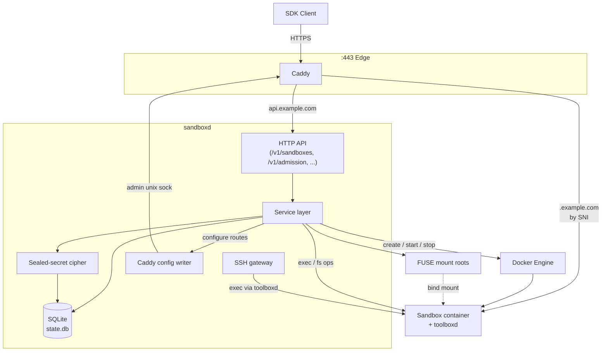
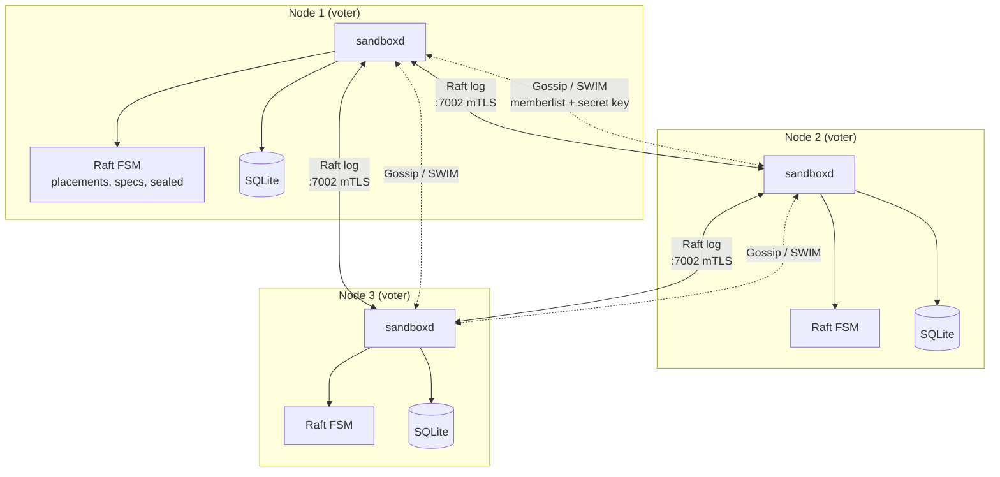
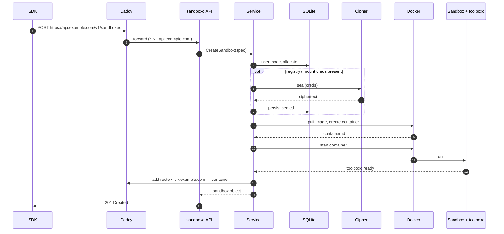
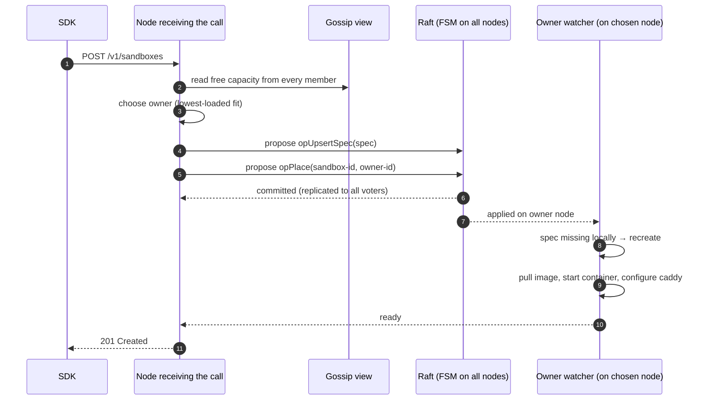
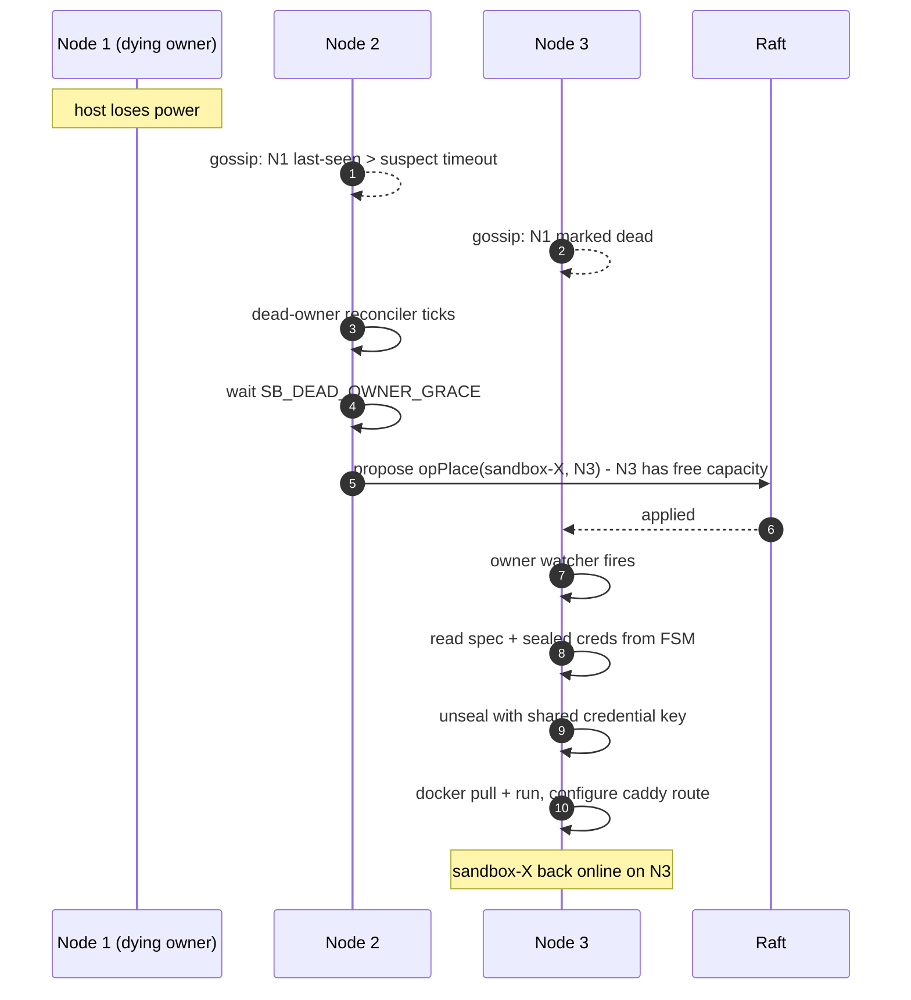

# Architecture

This document explains how AerolVM is built and how its pieces fit together.
It is intended to be readable end-to-end whether you are evaluating the system,
operating it, or hacking on it.

The reading order is:

1. **One-paragraph summary** - what AerolVM is.
2. **Glossary** - every term and dependency, with what it does and why it's
   here. Skim this first; refer back from later sections.
3. **Process model** - what runs on a host.
4. **Component diagrams** - how parts talk inside a single host, and across a
   cluster.
5. **Lifecycles** - what happens during the most important flows.
6. **Why these choices** - the trade-offs behind the architecture.

---

## 1. What AerolVM is

AerolVM is a daemon (`sandboxd`) that creates and manages **sandboxes** -
isolated Linux environments that run user code, expose HTTP/TCP services, and
mount external storage. It can run on one host (single-node) or across many
hosts that fail over to each other (cluster). Clients talk to it through
five SDKs (TypeScript, Python, Go, Rust, Java) over a single HTTPS endpoint.

A "sandbox" is, concretely, a Docker container with extra isolation
(optionally gVisor), an injected agent (`toolboxd`) that handles in-sandbox
operations, a public URL routed by Caddy, and metadata persisted in the local
SQLite store and (in cluster mode) replicated through Raft.

---

## 2. Glossary

The same word is used the same way everywhere in the codebase and these docs.

### Core processes

| Term | What it is | Why it's here |
|---|---|---|
| **`sandboxd`** | The control-plane daemon. One process per host. Owns the local SQLite store, the Docker integration, the Caddy config, the SSH gateway, and (in cluster mode) the Raft + gossip stack. | Single binary keeps deployment simple; single in-process source of truth eliminates cross-process coordination. |
| **`toolboxd`** | A small agent baked into every sandbox image. Runs as PID 1 inside the container and exposes a Unix-socket API that `sandboxd` calls for in-sandbox tasks (exec, file I/O, port discovery). | Lets the daemon do work *inside* the sandbox without `docker exec` overhead, and decouples the sandbox runtime from host kernel features. |
| **Caddy** | An HTTPS reverse proxy with the `caddy-l4` (layer-4 routing) and `caddy-dns/cloudflare` (DNS-01 ACME) plugins. Terminates TLS for the API and every sandbox URL. | Wildcard certs renew via DNS-01 so we never need port 80 open; SNI-based routing means one process serves every sandbox. |

### Sandbox concepts

| Term | What it is |
|---|---|
| **Sandbox** | A user-visible isolated environment: a container + agent + URL + storage + metadata. Identified by a stable `sandbox-id`. |
| **Sandbox URL** | The public HTTPS host for a sandbox: `https://<sandbox-id>.<domain>`. Created on first start, removed on delete. |
| **Exposed port** | An additional public URL for a TCP port the sandbox opens: `https://<sandbox-id>-<port>.<domain>` (HTTP) or `port:NNNN` (raw TCP, in the `22000-23000` range). |
| **External-storage mount** | A host-mounted FUSE filesystem (sshfs / NFS / S3 via `mountpoint-s3` / rclone) bind-mounted into the sandbox. Credentials are sealed before being persisted. |
| **Runtime** | `runc` (default Docker) or `gvisor` (`runsc`). Per-sandbox choice, set at create time. |
| **PAT** | Personal access token used by SDKs to authenticate to the API. Stored in `/etc/sandboxd/sandboxd.env` as `SB_PAT_TOKEN`. |

### Storage

| Term | What it is | Where |
|---|---|---|
| **State DB** | SQLite database - the source of truth for sandbox specs, ports, sessions, sealed creds, mounts. | `/var/lib/sandboxd/state.db` |
| **Sealed secret** | An AES-256-GCM ciphertext blob written into the state DB (and replicated through Raft) instead of a plaintext credential. Decrypted just-in-time during pulls and mounts. | Inline in DB columns |
| **Credential encryption key** | The 32-byte AES key that seals/unseals the above. **Cluster-wide:** all nodes must share it or failover-recovered sandboxes will fail to decrypt their pull/mount creds. | `/var/lib/sandboxd/credential_encryption.key` (mode 0600) and/or `SB_CREDENTIAL_ENCRYPTION_KEY` env var |
| **Mount root** | Per-sandbox FUSE mount directory on the host that gets bind-mounted into the container. | `/var/lib/sandboxd/mounts/<sandbox-id>/...` |
| **Caddy data dir** | Issued certs and ACME state. | `/var/lib/caddy/` |

### Cluster concepts

| Term | What it is | Why |
|---|---|---|
| **Placement** | The mapping `sandbox-id → owner-node-id`. The owner is the node that runs the container and serves API calls for that sandbox. | One owner per sandbox keeps state machine simple. |
| **Owner** | The node currently authoritative for a sandbox. Reads and writes the container, holds the runtime credentials, replies to API calls. | |
| **Spec** | Immutable desired state of a sandbox (image, env, mounts, runtime, etc.). Lives in the Raft FSM so any node can recreate the sandbox. | |
| **Raft** | A consensus protocol that replicates an ordered log of operations to every voter node. AerolVM uses [HashiCorp Raft](https://github.com/hashicorp/raft). | Strongly consistent placement and spec across nodes; survives the loss of a minority. |
| **FSM** | The Raft Finite State Machine - an in-memory data structure that applies log entries deterministically on every node. Holds placements, specs, sealed secrets. | Same FSM on every node = anyone can read it locally without coordination. |
| **Voter / Non-voter** | Two roles a node can have in Raft. Voters participate in elections and quorum; non-voters get the log but can't vote. New nodes start non-voter and are auto-promoted once gossip-authenticated. | Auto-promotion gated by gossip auth prevents a hostile node from casting a vote before it has proven cluster membership. |
| **Quorum** | Majority of voters (e.g. 2 of 3, 3 of 5). Required to commit log entries. | If quorum is lost the cluster goes read-only - see lost-quorum recovery. |
| **Gossip** | A SWIM-protocol membership and capacity broadcast layer using [HashiCorp memberlist](https://github.com/hashicorp/memberlist). Every node tells every other node "I'm alive" and "here's my free CPU/mem". | Lightweight liveness signal; raft is too heavy for per-second pings. |
| **Gossip secret key** | A 32-byte symmetric key shared by all nodes; signs and authenticates gossip packets. `SB_GOSSIP_SECRET_KEY`. | Without it any host that can reach the gossip port could join the membership view. |
| **Cluster TLS** | mTLS on the cluster-internal RPC port (`:7002`). All nodes share a CA-signed cert. | Ensures only authorized nodes can talk Raft / inter-node RPCs. |
| **TLS bundle** | The `aerolvm-tls-bundle.tar.gz` produced by `cluster-init.sh`. Contains `ca.crt`, `ca.key`, and `credential_encryption.key`. Joiners extract it on install. | Single artifact, single scp, complete trust setup. |
| **Owner watcher** | A goroutine on each node that watches placement changes; when this node becomes a new owner of a sandbox it doesn't yet have, it pulls the spec from the FSM and recreates the container. | Drives failover. |
| **Dead-owner reconciler** | A periodic loop that, when an owner has been gossip-down longer than `SB_DEAD_OWNER_GRACE`, proposes a `placement.move` Raft entry to a healthy node. | Turns "node missing for N minutes" into "sandbox is now owned by someone else." |
| **Admission** | The `/v1/admission` endpoint and underlying scheduler that picks an owner for a new sandbox based on per-node capacity (CPU/mem) advertised in gossip. | Decentralized scheduling - no central scheduler service. |

### External dependencies

| Term | What it is | Why we depend on it |
|---|---|---|
| **Docker Engine** | Container runtime. AerolVM speaks the Docker HTTP API on the local socket. | Mature image format, stable API, runs anywhere. We don't reinvent OCI. |
| **gVisor (`runsc`)** | A user-space kernel that intercepts syscalls; stronger isolation than `runc`, lower than a VM. Optional - opt in per-sandbox via `runtime: "gvisor"`. | Defense-in-depth for untrusted code without VM-level overhead. |
| **`fuse3`, `sshfs`, `nfs-common`, `rclone`, `mountpoint-s3`** | Filesystem clients used by external-storage mounts. | Pluggable per-mount backend; sandbox just sees a directory. |
| **Cloudflare DNS API** | The currently supported DNS provider for ACME DNS-01 challenges. | DNS-01 lets us renew wildcard certs without exposing port 80 or relying on probe-based HTTP-01. |
| **Let's Encrypt** | The CA Caddy uses for issuance. | Free, automated, ubiquitous. |
| **HashiCorp Raft + memberlist** | Battle-tested Go libraries for consensus and gossip. | Don't roll your own consensus. |
| **SQLite** | Embedded SQL store for local node state. | Zero ops, single file, transactional. |

### Authentication & secrets

| Term | What it is |
|---|---|
| **`SB_PAT_TOKEN`** | API bearer token. Required on every SDK request. |
| **`SB_GOSSIP_SECRET_KEY`** | Authenticates gossip packets between cluster nodes. |
| **`SB_CREDENTIAL_ENCRYPTION_KEY`** | Seals registry passwords and mount creds in the state DB / Raft FSM. |
| **`SB_CLUSTER_INSECURE_GOSSIP`** | Opt-out for unauthenticated gossip. Don't use in production. |
| **`SB_CLUSTER_INSECURE_CREDENTIALS`** | Opt-out for the cluster-wide credential key requirement. Don't use in production. |
| **CA cert / key** | Bootstrap material for cluster mTLS. Generated by `cluster-init.sh`. |

---

## 3. Process model on one host

```mermaid
flowchart LR
    subgraph Host
        SD[sandboxd<br/>:21212 internal<br/>:7002 cluster RPC]
        CD[caddy<br/>:443 (unix admin sock)]
        DK[dockerd]
        SSH[SSH gateway<br/>:2220]
        subgraph Containers
            C1[sandbox A<br/>+ toolboxd]
            C2[sandbox B<br/>+ toolboxd]
        end
    end

    CD <-->|reverse proxy| SD
    SD -->|Docker API| DK
    DK --> C1
    DK --> C2
    SD <-->|unix socket| C1
    SD <-->|unix socket| C2
    SSH -->|exec via toolboxd| C1
    SD --> SSH
```

`sandboxd` is the only AerolVM-specific process. Caddy, Docker, and the SSH
gateway are managed by the daemon (the SSH gateway is in-process; Caddy and
Docker are separate processes the daemon configures and depends on).

---

## 4. How the pieces talk

### 4.1 Single-host data plane



Key points:

- **All client traffic enters through Caddy on `:443`.** Caddy uses SNI to
  decide whether the request goes to the API (`api.<domain>`) or to a sandbox
  (`<sandbox-id>.<domain>` and `<sandbox-id>-<port>.<domain>`).
- **The service layer is the only thing that mutates state.** Everything -
  the Docker call, the SQLite write, the Caddy reconfigure - flows through
  one place so that failures can be unwound consistently.
- **Sealed creds** are decrypted only at the moment they're needed (image
  pull, mount establishment) and never logged.

### 4.2 Cluster control plane



Two independent layers:

- **Raft (mTLS, port 7002)** - strongly consistent, ordered. Used for
  *decisions*: who owns what, what specs exist, what's sealed.
- **Gossip (UDP/TCP via memberlist)** - eventually consistent, fast. Used for
  *signals*: who's alive, what their free capacity is.

### 4.3 What's where in the codebase

| Path | Responsibility |
|---|---|
| `cmd/sandboxd` | Process entry point. Loads config, builds dependencies, starts the daemon. |
| `cmd/toolboxd` | The in-sandbox agent. |
| `internal/config` | Env-var parsing and validation (including the cluster-mode credential-key safety check). |
| `internal/service` | The service layer - orchestration of store, runtime, caddy, secrets. |
| `internal/store` | SQLite access and migrations. |
| `internal/runtime` | Container lifecycle (Docker calls, runtime selection, port allocation). |
| `internal/cluster` | Raft, gossip, owner watcher, dead-owner reconciler, admission. |
| `pkg/api` | HTTP handlers and routing. |
| `pkg/caddy` | Caddy admin-API integration (writing routes). |
| `pkg/capacity` | Per-node CPU/mem accounting that feeds gossip. |
| `pkg/docker` | Thin Docker-API wrapper. |
| `pkg/models` | Shared types (Sandbox, Spec, Mount, etc.). |
| `pkg/mounts` | External-storage mount drivers. |
| `pkg/secrets` | The sealed-secret cipher and key loading. |
| `pkg/sshgateway` | The SSH-on-`:2220` gateway. |
| `sdk/{ts,py,go,rs,java}` | The five client SDKs. |

---

## 5. Lifecycles

### 5.1 Creating a sandbox (single-node)



API responses are **idempotent on the request id** - retrying a partial
create returns the same sandbox. This is enforced everywhere in the service
layer (see `pr-review.md`).

### 5.2 Creating a sandbox (cluster) - admission and placement



If the receiving node is *not* the chosen owner, it still answers the SDK -
it forwards the start-completion check to the owner via internal RPC.

### 5.3 Failover when a node dies



This is why the **credential encryption key must be the same on every node**
- `unseal` on N3 only works if N3 holds the key N1 used to `seal`.

### 5.4 A new node joining

```mermaid
sequenceDiagram
    autonumber
    participant Op as Operator
    participant Seed as Seed node
    participant New as New node

    Op->>Seed: scp aerolvm-tls-bundle.tar.gz
    Note over Seed: bundle = ca.crt + ca.key + credential_encryption.key
    Op->>New: install.sh
    Op->>New: cluster-join.sh --tls-bundle ... --seed ...
    New->>New: extract bundle, write keys, write cluster.env
    New->>Seed: gossip handshake (signed with shared key)
    Seed-->>New: welcome (membership view)
    New->>Seed: request raft join (mTLS via :7002)
    Seed->>Seed: add as non-voter
    Seed->>New: stream raft log
    New->>New: replay log → FSM caught up
    Seed-->>New: gossip-auth confirmed → promote to voter
    Note over New: ready; admission can place new sandboxes here
```

---

## 6. Why these choices

A few decisions in the architecture are non-obvious. The reasoning:

- **One daemon process per host (not microservices).** The control plane is
  small, latency-sensitive, and benefits from in-process consistency. A
  microservice split would mean RPCs for things that are currently struct
  field accesses.
- **SQLite, not Postgres.** The state DB only needs to serve one process,
  needs zero ops, and benefits from being in the same backup as everything
  else on disk.
- **Raft *and* gossip, not Raft alone.** Raft is the wrong tool for "is this
  node alive in the last 2 seconds" - every heartbeat would be a log entry.
  Gossip is the wrong tool for "who owns sandbox X" - it has no consistency
  guarantee. Each layer does what it's good at.
- **Gossip-auth-gated voter promotion.** A node can technically reach the
  Raft port and request to join even before it has proven membership. By
  requiring a gossip auth handshake before promoting from non-voter to
  voter, a hostile host can never cast a vote.
- **Sealed secrets in Raft, not plaintext.** Raft snapshots and logs hit disk
  on every voter. Plaintext credentials in those files would leak to every
  node's filesystem. Sealing keeps the plaintext only in `sandboxd` memory
  and only at use.
- **Cluster-wide credential key is mandatory.** Without it, a sealed cred
  written by node A is unreadable on node B - and you only discover this
  during failover, when it's already too late. The daemon refuses to start
  in cluster mode without a shared key (or an explicit
  `SB_CLUSTER_INSECURE_CREDENTIALS=true` opt-out).
- **DNS-01 wildcard, not HTTP-01 per sandbox.** Per-sandbox HTTP-01
  challenges would consume Let's Encrypt's 50-cert/week quota for the whole
  domain in a busy cluster. DNS-01 issues exactly two certs (`<domain>` and
  `*.<domain>`) regardless of sandbox count.
- **Caddy with `caddy-l4`, not raw nginx/HAProxy.** The L4 plugin lets us
  expose raw TCP sandbox ports through the same TLS-fronted endpoint as
  HTTP, which keeps the firewall surface minimal.
- **Docker, not a custom OCI runtime.** Image format compatibility is the
  point - anything you can `docker run` works as a sandbox base image.
  gVisor is opt-in via the standard Docker runtime mechanism.

---

## See also

- [`local.md`](./local.md) - laptop install (`--local`).
- [`single-node.md`](./single-node.md) - production single-host.
- [`cluster.md`](./cluster.md) - multi-node deployment, failover, recovery.
- [`../pr-review.md`](../pr-review.md) - invariants every code change must
  preserve.
